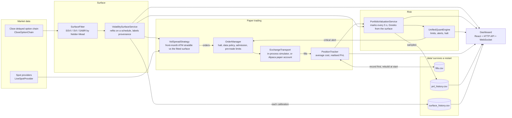

# Options Pricing & Paper-Trading Engine (AURA-OPT)

[](https://github.com/sivuhsGorha/options-pricing-engine/actions)
[](https://openjdk.org/)

A Java 25 options pricing and risk library with a paper-trading loop and a web dashboard. It prices
options, calibrates volatility surfaces, computes Greeks and portfolio risk, and runs an order flow
(pre-trade checks, risk admission, simulated fills) against live or simulated market data.

**What it is not:** a connection to any exchange, or to real money. There is no exchange market-data feed.
Orders fill either in the built-in paper-trading simulator or, with `execution.transport: alpaca`, in an
Alpaca *paper* account (the client can only address the paper endpoint), and the book is reconciled with
that account every minute. The `gateways/` package and `execution/SmartOrderRouter` are simulations of
binary-protocol encoding and decoding (see their class headers). No latency figure is measured or claimed.

---

## What is implemented

| Area | Implementation |
| :--- | :--- |
| Closed-form pricing | Black-Scholes-Merton with continuous dividend yield; accurate normal CDF; safeguarded Newton implied-volatility solver |
| Early exercise | Trinomial tree; Crank-Nicolson PDE (Rannacher start, Brennan-Schwartz) in log-spot; discrete-dividend PDE pricer |
| Monte Carlo | European Monte Carlo pricer used as a cross-check for the closed form; VaR / expected shortfall calculators |
| Volatility | SVI, SSVI with no-arbitrage conditions and validation, SABR (Hagan), Dupire local vol; a background service fits SSVI, raw SVI and SABR to the same option-chain quotes (Nelder-Mead least squares) and the dashboard shows the fit's source, quotes, RMSE and parameters |
| Rates | OIS / par-yield curve bootstrap, ACT/365F day count, optional FRED and ESTR providers |
| Greeks and risk | First, second and higher-order Greeks, portfolio aggregation, limit alerts that halt trading, margin approximation (not an exchange margin model) |
| Execution | `OrderManager` (halt check, data-quality policy, portfolio admission, pre-trade limits, order state machine, audit trail), `PositionTracker` with average cost and realised P&L, option contracts booked per OCC symbol with their multiplier, exact decimal ticks. Two transports: the in-process simulator, and an Alpaca paper account (day limit orders at the venue's own touch, fill polled, remainder cancelled and the cancel settled before the fill is booked, book reconciled with the account every minute and trading halted on a mismatch). First live session on 2026-10-09: two fills, one reconciliation halt, logged in [EXECUTION.md](EXECUTION.md) |
| Strategy and valuation | Vol-spread strategy: the front-month ATM straddle against the fitted surface, delta-hedged, every decision recorded; a share momentum strategy as the alternative mode. A valuation service marks the book every few seconds with Black-Scholes Greeks at the surface's vol and feeds them to the risk engine, whose alerts use the configured limits. P&L (today's with its drawdown, and since the ledger began) and every calibration's ATM vol and skew are recorded under `data/` and shown on the dashboard across restarts |
| Dashboard | Embedded HTTP API and a Jetty WebSocket feed, HMAC request signing, browser sessions, React frontend with risk, volatility-surface and paper-trading panels |
| IPC | Engine state published through a memory-mapped file (seqlock) and read by the web layer |

Spot prices come from Finnhub, Polygon, Alpha Vantage and MarketStack when API keys are configured; option
chains come from Cboe's public delayed feed (every expiry, no key) with a synthetic fallback that is always
labelled as such. Every quote carries a status (LIVE, DELAYED, STALE, UNAVAILABLE, SIMULATED); only fresh LIVE
or DELAYED quotes can back an order, and a field a provider does not publish is shown as unknown, never as a
placeholder. See [DATA.md](DATA.md).

---

## How it works

One pass through the system, from a quote to a risk number. Every box is a class you can open; nothing in
the picture is a placeholder.



1. **Chain in.** The Cboe delayed feed supplies every listed expiry of the symbol; the service picks the
   expiries nearest 1, 2, 3 and 6 months, inverts the out-of-the-money two-sided quotes to implied volatility,
   and fits three surfaces to the same points. Each fit reports its RMSE and parameters, and the result says
   where the chains came from. A synthetic fallback is labelled `DEMO` and is never mixed with market chains.
2. **Strategy.** Every 30 s the vol-spread strategy compares the front-month ATM straddle's market vol with the
   SSVI reference. Outside the edge band it sells or buys the straddle and hedges the delta with shares; it
   refuses stale or simulated quotes and records every decision with its reason.
3. **Order gates.** An order passes the halt check, the data-quality policy (fresh LIVE or DELAYED quotes
   only), portfolio admission (projected Greeks against the limits), the pre-trade filter (size, notional,
   concentration, liquidity), and only then the transport: the simulator fills with slippage; the Alpaca
   transport sends a day limit order at the venue's own touch, waits for the fill, cancels any remainder and
   waits for the cancel to settle before booking what filled.
4. **Book.** A fill is written to the ledger before the book changes, so memory never runs ahead of the record;
   at start the book, average cost and realised P&L are rebuilt from the ledger.
5. **Risk.** The valuation service marks each position at its quote mid (or model price) with Greeks from the
   fitted surface, pushes them into the positions, and samples P&L for the day's figure and drawdown. The risk
   engine checks the limits and a critical breach halts trading.
6. **Dashboard.** The surface (shape and fit error), smile and term structure, the surface's ATM vol and skew
   over the day, the strategy's last decision, the order tape, positions with marks and P&L, and the operator
   controls (halt, resume, strategy on/off).

---

## Quick start

Prerequisites: JDK 25, Maven 3.9+, and Node 22 only if you rebuild the frontend.

```bash
# Build and test (476 tests, JaCoCo coverage gate)
mvn clean verify

# Configuration: copy config.example.yaml to config.yaml, and put secrets in .env (never committed):
#   API_SECRET=<at least 32 characters>
#   OPERATOR_PASSWORD=<at least 12 characters>
#   FINNHUB_KEY=...  POLYGON_API_KEY=...  (any provider you have)

# Check the configuration and environment without starting anything (exit 0 = valid)
java -jar target/options-pricing-engine-1.0.0-SNAPSHOT.jar --check-config

# Run the engine and the dashboard (http://127.0.0.1:8080, WebSocket on port 8081)
java --add-modules jdk.incubator.vector -jar target/options-pricing-engine-1.0.0-SNAPSHOT.jar

# Optional: refresh market_data.csv from a real provider (exits with status 2 if none answers)
python fetch_real_api_data.py

# Or run it in Docker with the same .env (published to localhost only)
docker compose up --build -d
```

[RUNBOOK.md](RUNBOOK.md) covers health, common symptoms and their causes, secrets and upgrades.

Sign in with `OPERATOR_PASSWORD`. The paper-trading panel shows positions and every order with its fill or
rejection reason, with HALT / RESUME and a strategy switch. `run_all.ps1` runs the same checks as CI locally:
the Java build with 476 tests and the coverage gate, the Python tests, and the frontend lint, 47 tests and build.

---

## Documentation

- [EXECUTION.md](EXECUTION.md): the order path, paper fills, the API, and what the gateway simulations are
- [RISK.md](RISK.md): every gate an order passes, Greeks, alerts and halt, VaR/ES, the margin approximation
- [DATA.md](DATA.md): spot providers and statuses, option chains, rates, dividends, known placeholders
- [STRATEGY.md](STRATEGY.md): the implemented strategy and the research backlog
- [BACKTEST.md](BACKTEST.md): what the backtester does and its simplifications
- [RESEARCH.md](RESEARCH.md): the mathematics of each model and its limits
- [DESIGN.md](DESIGN.md): the dashboard, panel by panel
- [INFRA.md](INFRA.md): build, configuration, environment variables, process layout, CI
- [HFT_ARCHITECTURE.md](HFT_ARCHITECTURE.md): design notes for the memory-mapped IPC and vectorised maths
- [ROADMAP.md](ROADMAP.md): done, this week, later
- [CONTRIBUTING.md](CONTRIBUTING.md), [CODE_STYLE.md](CODE_STYLE.md), [AGENTS.md](AGENTS.md): working agreements
