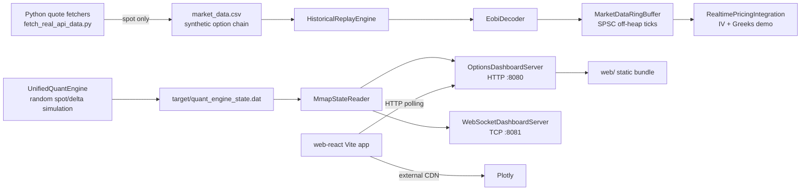

# Architecture and runtime map

## Implemented architecture

### Component boundaries and data flow

| Component | Implemented role | Boundary assessment |
|---|---|---|
| `fetch_real_api_data.py` | Fetches one SPY quote from providers then synthesizes a 42-row option CSV from Black-Scholes. | [VERIFIED] It does not fetch an option chain or validate source timestamps/quality. |
| Gateway/replay | Parses CSV into a 37-byte simulated EOBI packet and puts L1 ticks into an SPSC buffer. | [VERIFIED] It is a local replay, not an external exchange connection. |
| Quant models | Provides independent calculators and model demonstrations. | [VERIFIED] Models share no common input/market convention layer. |
| Unified engine | Schedules random price/delta changes every 10 ms and writes four doubles to an mmap file. | [VERIFIED] It does not consume the gateway or order state. |
| Dashboard server | Serves static content and three unauthenticated JSON endpoints; reads mmap. | [VERIFIED] It is the only server runtime in the Docker command. |
| React app | Polls `/api/*`, renders charts, and generates its own random tape/latency. | [VERIFIED] It is separate from the static `web/` bundle served by Java and has no production proxy/build integration. |

## Entry points, lifecycle, jobs

| Entry point | Lifecycle |
|---|---|
| `com.sbk.optionspricer.Main` | Executes print-oriented suites then starts `UnifiedQuantEngine`; the engine’s daemon executor ends when `main` exits ([`Main.java`](/C:/options-pricing-engine/src/main/java/com/sbk/optionspricer/Main.java:19)). |
| `RealtimePricingIntegration` | Replays a local CSV and hard-stops after exactly 42 messages ([`RealtimePricingIntegration.java`](/C:/options-pricing-engine/src/main/java/com/sbk/optionspricer/gateways/RealtimePricingIntegration.java:34)). |
| `OptionsDashboardServer` | Starts HTTP on `$PORT`/8080 and WebSocket on port+1, with no shutdown hook ([`OptionsDashboardServer.java`](/C:/options-pricing-engine/src/main/java/com/sbk/optionspricer/web/OptionsDashboardServer.java:24)). |
| `fetch_market_data.py` / `fetch_real_api_data.py` | Manual scripts; no scheduler, lock, or atomic file replacement. |
| `run_all.ps1` | Compiles all Java then runs executable demo/test classes sequentially. |

There are **no implemented scheduled jobs, queue workers, health endpoints, database transactions, or order-retry/idempotency lifecycle**. [VERIFIED]

## State and data model

| State | Representation | Where it lives |
|---|---|---|
| Option inputs | `OptionParameters` record: spot, strike, expiry, rate, vol, dividend yield | In process |
| L1 tick | `OrderBookTick` flyweight over a 40-byte off-heap segment | Ring-buffer arena |
| Risk state | delta, gamma, vega, margin | Four doubles in `target/quant_engine_state.dat` |
| Positions | mutable `PortfolioPosition` fields held in an `ArrayList` | In process only |
| Orders | immutable `Order` record | In process only; no state after route method returns |
| Market data | CSV rows | Repository working directory |

No persistent trade/order/audit model, user/account model, ownership relationship, schema, migration, or index is implemented. [VERIFIED]

## Dependencies

### Java

The Java source imports standard JDK APIs plus `jdk.incubator.vector`; no Maven `pom.xml`, Gradle files, or Java dependency lockfile exists. [VERIFIED] The source relies on `java.lang.foreign` APIs while the Dockerfile declares JDK 21; local compilation used JDK 26.0.1.

### React (lockfile-resolved direct packages)

| Package | Locked version | Role |
|---|---:|---|
| `react`, `react-dom` | 19.3.0 | UI |
| `ogl` | 1.0.11 | WebGL visual |
| `vite` | 8.3.1 | build/dev server |
| `@vitejs/plugin-react` | 6.1.1 | Vite transform |
| `oxlint` | 1.86.0 | lint |

`npm.cmd audit --package-lock-only --json` timed out after 63.6 seconds with no audit response, so vulnerability status is **[UNKNOWN]** rather than clean. The command was not retried with network escalation. The direct package versions above are newer than their declared caret ranges, demonstrating a committed lockfile, but current supported-status has not been independently established.

### Python

`requirements.txt` pins 18 packages, including `requests 2.34.2`, `pandas 3.0.6`, `numpy 2.5.3`, `yfinance 1.7.0`, and `websockets 17.1`. [VERIFIED] Neither script imports those packages: both use the standard library. There is no lockfile or dependency audit output for Python.

## Build, deploy, and environment configuration

- **Local build actually used:** `javac --add-modules jdk.incubator.vector -d target/classes <all Java files>` on JDK 26.0.1. It completed with one incubator warning.
- **Runtime actually exercised:** `java --add-modules jdk.incubator.vector -cp target/classes com.sbk.optionspricer.Main`.
- **Container path:** Docker copies only `src` and `web`, attempts a partial package compilation, then starts `OptionsDashboardServer`. It does not copy `market_data.csv`, Python scripts, React source/build, or any config/secrets.
- **Environment:** only `PORT` is consumed by Java. Provider keys are read by Python but have insecure source defaults. No environment validation, configuration schema, or secret manager exists.

The Docker build cannot compile the declared source set: `core` requires other packages omitted by its `javac` glob, and the required Vector module flag is absent ([`Dockerfile`](/C:/options-pricing-engine/Dockerfile:12)). [VERIFIED]
